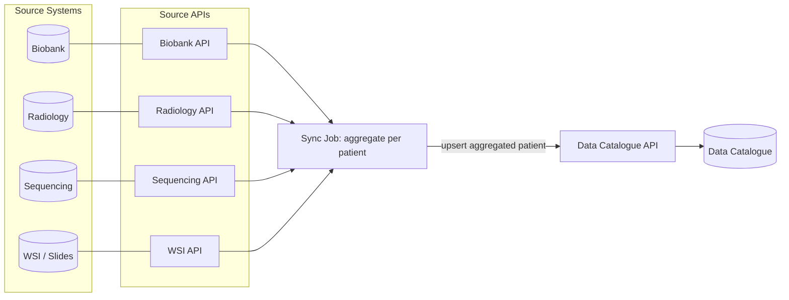
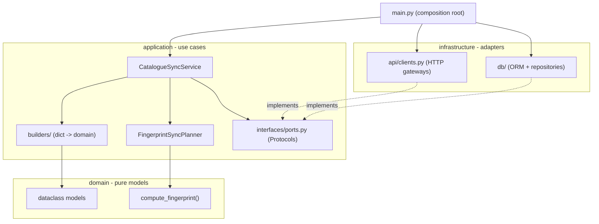
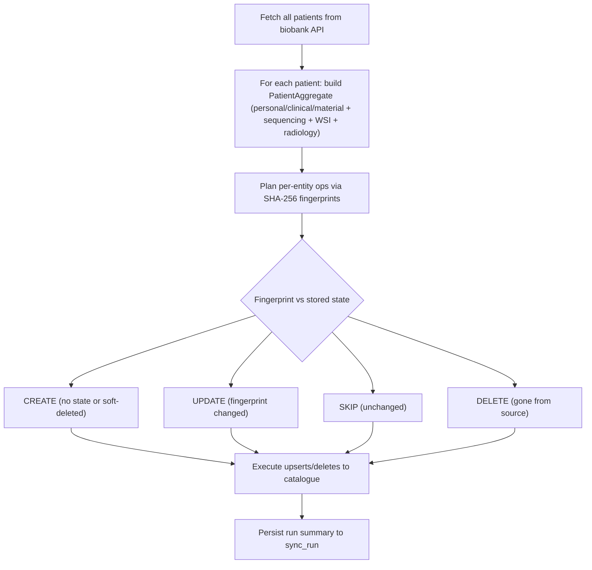
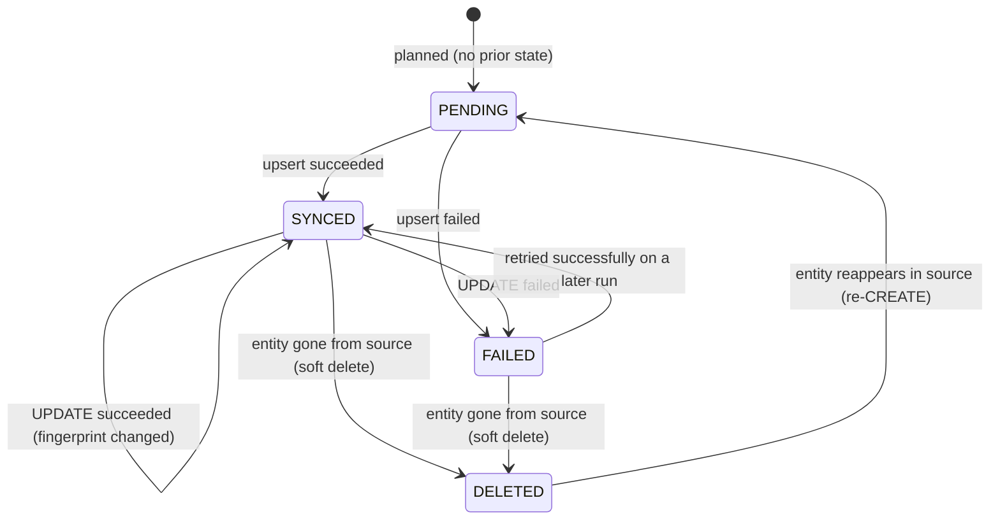

# Architecture Overview

This service synchronizes patient-related data from multiple source systems into the data catalogue.

At a high level:
- each source system exposes its own API,
- the sync job calls those APIs,
- it aggregates source data into one patient-level record,
- and upserts that record to the catalogue.

In one sentence: for each patient, the sync job reads from all source APIs, aggregates the data into one coherent record, and uploads it into the data catalogue.

## Code structure (hexagonal / layered)

The code under `src/` is organized into three layers with a strict dependency direction: `infrastructure` -> `application` -> `domain`. The domain layer has no outward dependencies.

| Layer | Path | Responsibility |
|-------|------|----------------|
| Domain | `src/domain/` | Pure dataclass models and `compute_fingerprint`. No I/O, no framework imports. |
| Application | `src/application/` | Orchestration (`sync_service.py`), planning (`sync_planner.py`), `builders/`, and the `interfaces/ports.py` Protocols. |
| Infrastructure | `src/infrastructure/` | Adapters implementing the ports: HTTP gateways (`api/clients.py`) and DB ORM + repositories (`db/`). |

The ports in `src/application/interfaces/ports.py` (`SourceDataGateway`, `CatalogueGateway`, `SyncStateRepository`, `SyncPlanner`) are `typing.Protocol`s. Infrastructure provides concrete implementations, and `main.py` wires them together from environment variables.

## Sync flow

1. **Fetch** all patients from the biobank API (`GET /patients`).
2. **Aggregate** each patient: personal/clinical/material from the biobank payload, sequencing (by `predictive_number`), WSI (by `bioptic_number`), and radiology (by `accession_numbers`).
3. **Plan** per-entity operations in dependency order using SHA-256 fingerprints (`compute_fingerprint`): CREATE when there is no prior state or the entity was soft-deleted, UPDATE when the fingerprint changed, SKIP when unchanged, DELETE when entities disappear from the source.
4. **Execute** the plan against the catalogue API (upsert or delete per entity).
5. **Patients missing** from the current run are deleted in the catalogue and soft-deleted in the DB subtree.
6. **Persist** the run summary (scanned / changed / uploaded / deleted / skipped / failed) to `sync_run`.

Upload eligibility: a patient is only uploaded if it has at least one sample (`PatientAggregate.is_upload_eligible()`).

## Sync state machine

Two enums in `src/domain/models/sync.py` drive change detection. They are distinct concepts:

- **`SyncOp`** is the *decision* the planner makes for an entity on this run: `CREATE`, `UPDATE`, `SKIP`, or `DELETE`.
- **`SyncStatus`** is the *persisted state* of an entity in the DB between runs: `PENDING`, `SYNCED`, `FAILED`, or `DELETED`.

Each entity (patient, sample, sequencing, WSI, imaging study) carries its own state, persisted in its per-entity `*_sync_state` table alongside the fingerprint.

| Status | Meaning | Set when |
|--------|---------|----------|
| `PENDING` | Planned this run, not yet executed (also the default for a brand-new entity). | Planner creates a new state, or no prior state exists (`sync_planner.py`). |
| `SYNCED` | Successfully upserted to the catalogue. | Execution of a `CREATE`/`UPDATE` op succeeds (`sync_service.py`). |
| `FAILED` | The upsert/delete for this entity failed; the run continues for others. | Execution of an op raises (`sync_service.py`). |
| `DELETED` | Entity disappeared from the source; deleted in the catalogue and soft-deleted in the DB. | Planner emits a `DELETE` op, or the repository soft-deletes a subtree (`sync_planner.py`, `sync_state_repository.py`). |

A soft-deleted (`DELETED`) entity that reappears in the source is treated as a fresh `CREATE` on the next run, returning it to `PENDING` → `SYNCED`.
