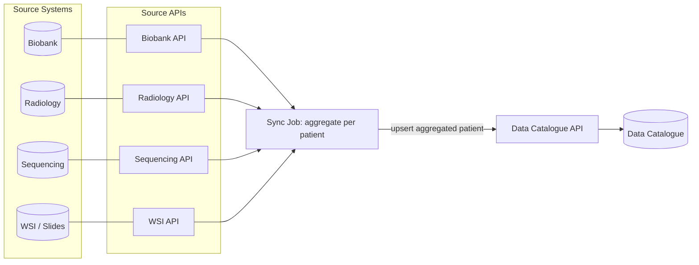
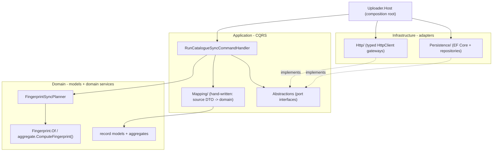
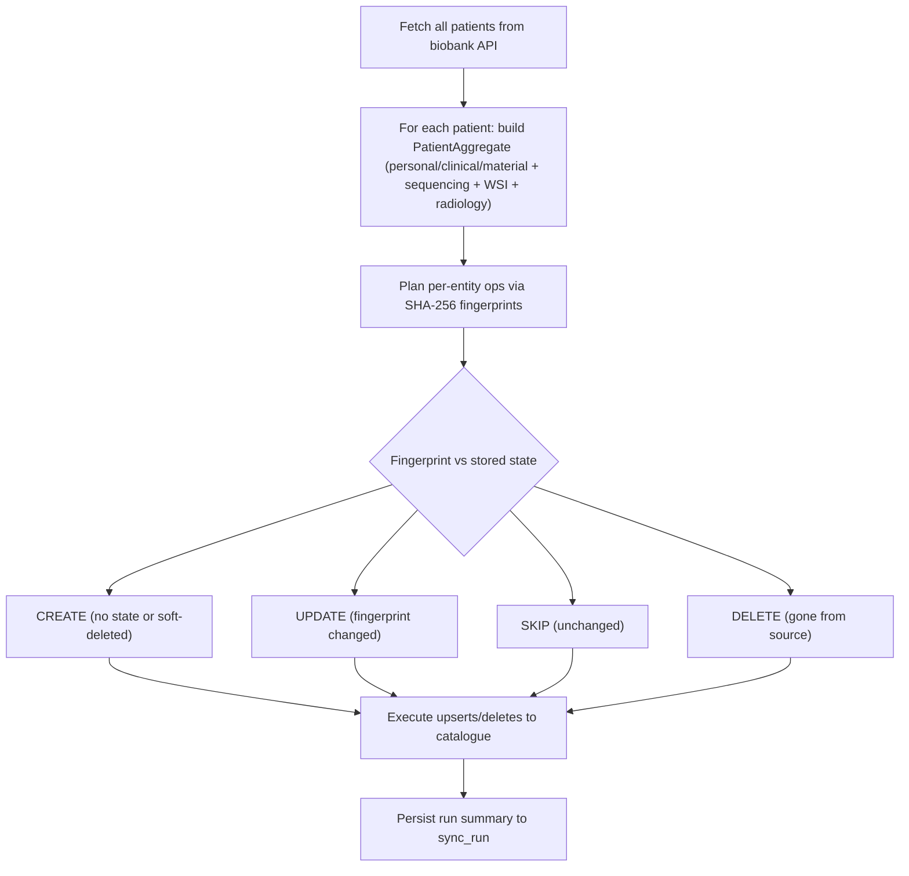
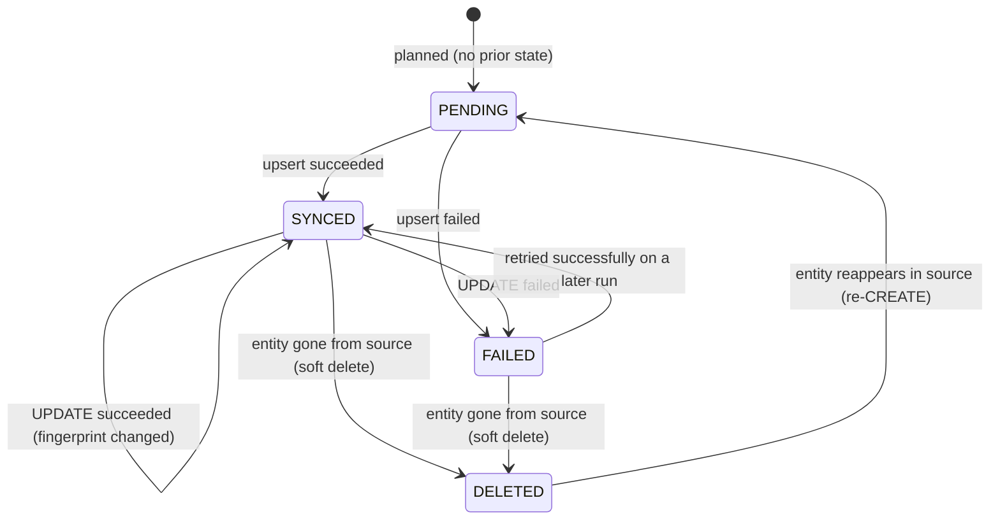

# Architecture Overview

> This repository is a **.NET solution** (`DataCatalogueUpload.slnx`). The services - the `uploader`
> sync job and the source APIs (`biobank_api` and `sequencing_api`) - live under `src/`.
> This document describes the **uploader** and the end-to-end data flow; each service follows the same
> Clean Architecture layering. See [`AGENTS.md`](AGENTS.md) for the solution layout.

The uploader synchronizes patient-related data from multiple source systems into the data catalogue.

At a high level:
- each source system exposes its own API,
- the sync job calls those APIs,
- it aggregates source data into one patient-level record,
- and upserts that record to the catalogue.

In one sentence: for each patient, the sync job reads from all source APIs, aggregates the data into one coherent record, and uploads it into the data catalogue.

## Code structure (Clean Architecture / layered)

The uploader's projects under `src/Uploader/` follow a strict dependency direction: `Host` -> `Infrastructure` -> `Application` -> `Domain`. The domain layer has no outward dependencies.

| Layer | Path | Responsibility |
|-------|------|----------------|
| Domain | `src/Uploader/Uploader.Domain/` | Record models + aggregates, the domain service `FingerprintSyncPlanner`, and the `Fingerprint` value object each aggregate uses for its `ComputeFingerprint()`. No I/O, no framework dependencies. |
| Application | `src/Uploader/Uploader.Application/` | CQRS `RunCatalogueSyncCommand` + handler, `Dtos/` + the hand-written mappers (`Mapping/`: one per source - `PatientMapper`, `SampleMapper`, `SequencingMapper`, `WsiMapper`, `ImagingStudyMapper` - plus `BiobankMapping` for the biobank's derived values), and the port interfaces in `Abstractions/`. Outbound, `CatalogueMapper` turns aggregates into the FAIR Genomes records under `Dtos/Catalogue/`, substituting a pseudonym for every real identifier - see [`docs/pseudonymization.md`](docs/pseudonymization.md). |
| Infrastructure | `src/Uploader/Uploader.Infrastructure/` | Adapters implementing the ports: typed `HttpClient` gateways (`Http/`) and EF Core + repositories (`Persistence/`). |

The ports in `Uploader.Application/Abstractions` (`ISourceDataGateway`, `ICatalogueGateway`, `ISyncStateRepository`, `ISyncRunRepository`, `IPseudonymMap`) are interfaces. Infrastructure provides concrete implementations, and `Uploader.Host` wires them together from environment variables. Planning is a domain service (`ISyncPlanner`).

## Sync flow

1. **Fetch** all patients from the biobank API (`GET /patients`).
2. **Aggregate** each patient: personal/clinical/material from the biobank payload, sequencing (by `predictive_number`), WSI (by `bioptic_number` - the biobank serves none, so this stays empty until #31), and radiology (by `accession_numbers`, patient-level and sample-level combined). Every source serves its own vocabulary; translating it is the uploader's job, and the values it cannot place yet are carried raw until the catalogue contract fixes them. The sequencing API answers with `samples[] -> runs[]` - a predictive number is not unique and a sample can be resequenced - which the uploader flattens into one FAIR `SamplePreparation` per (sample, run) pair. An unknown predictive number comes back `200` with an empty `samples`: no sequencing record, and not a failure.
3. **Plan** per-entity operations in dependency order using SHA-256 fingerprints (each aggregate's `ComputeFingerprint()` over `Fingerprint.Of(...)`): CREATE when there is no prior state or the entity was soft-deleted, UPDATE when the fingerprint changed, SKIP when unchanged, DELETE when entities disappear from the source.
4. **Execute** the plan against the catalogue API (upsert or delete per entity).
5. **Patients missing** from the current run are deleted in the catalogue and soft-deleted in the DB subtree.
6. **Persist** the run summary (scanned / changed / uploaded / deleted / skipped / failed) to `sync_run`.

Upload eligibility: a patient is only uploaded if they consented and have at least one sample (`PatientCatalogueData.IsUploadEligible`). Consent is checked explicitly rather than being left to follow from the biobank refusing to attach samples to a non-consenting patient; it is permission, not content, so it stays out of the fingerprint.

## Sync state machine

Two enums in `Uploader.Domain/Sync/SyncState.cs` drive change detection. They are distinct concepts:

- **`SyncOp`** is the *decision* the planner makes for an entity on this run: `CREATE`, `UPDATE`, `SKIP`, or `DELETE`.
- **`SyncStatus`** is the *persisted state* of an entity in the DB between runs: `PENDING`, `SYNCED`, `FAILED`, or `DELETED`.

Each entity (patient, sample, sequencing, WSI, imaging study) carries its own state, persisted in its per-entity `*_sync_state` table alongside the fingerprint.

| Status | Meaning | Set when |
|--------|---------|----------|
| `PENDING` | Planned this run, not yet executed (also the default for a brand-new entity). | Planner creates a new state, or no prior state exists (`FingerprintSyncPlanner`). |
| `SYNCED` | Successfully upserted to the catalogue. | Execution of a `CREATE`/`UPDATE` op succeeds (`RunCatalogueSyncCommandHandler`). |
| `FAILED` | The upsert/delete for this entity failed; the run continues for others. | The catalogue gateway returns an error for an op (`RunCatalogueSyncCommandHandler`). |
| `DELETED` | Entity disappeared from the source; deleted in the catalogue and soft-deleted in the DB. | Planner emits a `DELETE` op, or the repository soft-deletes a subtree (`FingerprintSyncPlanner`, `SyncStateRepository`). |

A soft-deleted (`DELETED`) entity that reappears in the source is treated as a fresh `CREATE` on the next run, returning it to `PENDING` → `SYNCED`.
