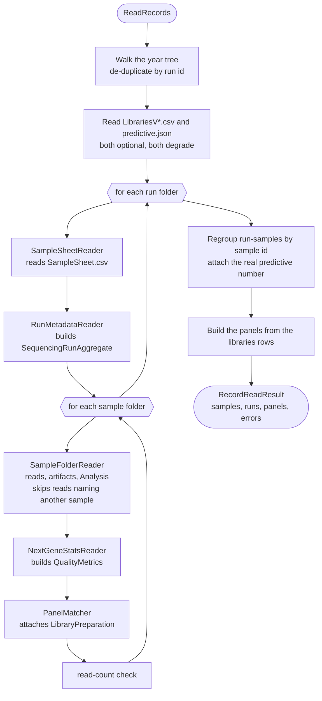

# MMCI ingestion map

Where every field of the sequencing domain model comes from, and the rules the MMCI adapter follows.
Use it when a field is empty or wrong and you need to know which file on disk was supposed to fill it.

For the shape of the model see [`src/SequencingApi/README.md`](../src/SequencingApi/README.md); for
what the data catalogue accepts see [`fair-genomes.yml`](fair-genomes.yml). Everything below lives in
`src/SequencingApi/SequencingApi.Infrastructure/DataSource/Mmci/`.

## The source tree

Three configured roots (`SequencingOptions`, wired in `Infrastructure/DependencyInjection.cs`):

| Env var | Production path | Holds |
|---|---|---|
| `SEQUENCING_DATA_PATH` | `/muni-sc/OrganisedRuns` | the run tree |
| `SEQUENCING_LIBRARIES_PATH` | `/muni-sc/Libraries` | `LibrariesV*.csv` + `BEDs/` |
| `SEQUENCING_MAPPING_TABLE_PATH` | `/home/export/pseudonymization_table` | `predictive.json` |

```
OrganisedRuns/
├── 2019..2025/                          <- only 4-digit folders are walked
│   ├── MiSEQ/<subtype>/<runId>/         subtype = complete-runs | mamma-print | missing-analysis
│   └── NextSeq/<runId>/
└── backups/  errors/  logs/             <- skipped: both duplicate runs already in the tree

<runId>/  RunInfo.xml  RunParameters.xml|runParameters.xml  CompletedJobInfo.xml
          RunCompletionStatus.xml  AnalysisLog.txt  SampleSheet.csv  Samples/
<runId>/Samples/<pseudonymized predictive number>/  FASTQ/  Analysis/
<sample>/Analysis/  <id>_StatInfo.txt  <id>_Parameters.txt  *.bam  Reports/
```

Encodings and separators, because they are what makes these files hard to read by hand:

| File | Encoding | Key/value separator |
|---|---|---|
| `<id>_StatInfo.txt` | Windows-1250 | **colon** |
| `<id>_Coverage_Curve_Report1_Statistics.txt` | Windows-1250 | **tab** |
| `LibrariesV*.csv` | Windows-1250 | **semicolon**, quoted cells |
| `SampleSheet.csv` | Windows-1250 | comma, `[Section]` blocks |

Reading one by hand: `iconv -f WINDOWS-1250 -t UTF-8 <file>`, and add `| cat -A` when the separator
is the question (`^I` is a tab).

## How ingestion works

One pass over the tree per ingest. `SequencingDataSource` orchestrates; every other class is a pure
reader it calls. Runs are read one at a time, and the sample aggregates only exist at the very end —
the tree is organised by run, the domain by sample, so the regrouping is the last step.



## The classes

All in `src/SequencingApi/SequencingApi.Infrastructure/DataSource/Mmci/`, all prefixed `Mmci`.

| Class | Owns |
|---|---|
| [`SequencingDataSource`] | the tree walk, run de-duplication, sheet reconciliation, regrouping run-samples into samples, building panels, and every error record |
| [`RunFolder`] | one discovered run folder: its id, instrument, subtype, sample-folder count |
| [`RunMetadataReader`] | the whole `SequencingRunAggregate` from the run's XML files and `AnalysisLog.txt` |
| [`SampleSheetReader`], [`SampleSheet`], [`SampleSheetRow`] | `SampleSheet.csv` — `[Header]` keys and `[Data]` rows |
| [`SampleFolderReader`] | one sample folder: read files, analysis artifacts, file roles, reference genome |
| [`NextGeneStatsReader`] | the two NextGENe statistics reports → `QualityMetrics` |
| [`LibrariesTableReader`], [`LibraryRow`] | the versioned libraries CSVs, their version ordering and back-fill |
| [`PanelMatcher`] | sample → panel, and the row → `LibraryPreparation` conversion |
| [`MappingTableReader`], [`MappingTable`] | `predictive.json` → the real predictive number |
| [`SourceValues`] | all value decoding: Windows-1250, decimal commas, Czech booleans, dates, quantities, quoted cells, gene lists |

## Where each field comes from

**Read by** links to the class that does the work. Every file in `DataSource/Mmci/` is prefixed
`Mmci`, dropped here for width — [`SampleFolderReader`] is `MmciSampleFolderReader.cs`. A method in
brackets after the link, like [`SourceValues`] (`Quantity`), points at the part that does the
decoding. Value decoding in general (decimal commas, Czech booleans, dates, Windows-1250) is
[`SourceValues`] throughout, named only where it is the interesting part.

### `SampleAggregate`

| Field | Comes from | Where in it | Read by |
|---|---|---|---|
| `Id` | **the folder name** | `Samples/<pseudonymized predictive number>` | [`SequencingDataSource`] |
| `IdScheme` | **constant** | `"mmci_predictive"` | [`SequencingDataSource`] |
| `PredictiveNumber` | `predictive.json` | `predictive[]`, match `pseudo_number` → take `predictive_number`. Unmatched is null and normal | [`MappingTableReader`], [`MappingTable`] |
| `RunSamples` | the folder tree | one per run folder containing this sample id | [`SequencingDataSource`] |
| `HasAnalysis` | *derived* | any run-sample has an analysis | domain |

### `RunSample`

| Field | Comes from | Where in it | Read by |
|---|---|---|---|
| `Id` / `RunId` | **the run folder name** | upper-cased | [`RunFolder`], [`SequencingDataSource`] |
| `SampleIndex` | FASTQ **file name** → `SampleSheet.csv` | `_S<n>_` → else the `[Data]` row's 1-based position | [`SampleFolderReader`], [`SampleSheetReader`] |
| `SampleType` | `SampleSheet.csv` | `[Data]` column `Sample_Type`; `DNA`/`RNA` only, NextSeq sheets only | [`SampleSheetReader`], [`SampleFolderReader`] |
| `LaneCount` | FASTQ **file names** | count of distinct parsed lanes — not the flowcell's lane count | [`SampleFolderReader`] |
| `LibraryPreparation` | `LibrariesV*.csv` | via the panel matcher; see its own table | [`PanelMatcher`] |
| `Files` | `<sample>/FASTQ/*.fastq.gz` | | [`SampleFolderReader`] |
| `Analyses` | `<sample>/Analysis/` | at most one | [`SampleFolderReader`] |
| `HasFastq`, `HasAnalysis` | *derived* | | domain |

### `SequencingFile` — reads

All of these are `SampleFolderReader`, from the demultiplexer's filename pattern.

| Field | Comes from | Where in it | Read by |
|---|---|---|---|
| `Role` | **constant** | always `Fastq` | [`SampleFolderReader`] |
| `Path` | the file path | stored **relative** to the runs root | [`SampleFolderReader`] |
| `Format` | **constant** | `"fastq.gz"` | [`SampleFolderReader`] |
| `Lane` | the **file name** | `_L<n>_`; the segment is optional, so an absent lane is null | [`SampleFolderReader`] |
| `Read` | the **file name** | `_R<n>_` | [`SampleFolderReader`] |
| `SizeBytes` | filesystem `stat` | | [`SampleFolderReader`] |
| `Checksum` | *never filled* | | — |

### `SequencingFile` — analysis artifacts

| Field | Comes from | Where in it | Read by |
|---|---|---|---|
| `Role` | the **file name** | `.bam`→`Bam`; `.bai`→`BamIndex`; `.vcf`→`VcfFiltered` if it contains "Filtered" else `Vcf`; `_SummaryReport.pdf`→`SummaryReport`; `.txt` containing `Coverage_Curve`→`CoverageReport` or `Mutation_Report`→`VariantReport`. Unrecognised files are skipped, never stored as `Other` | [`SampleFolderReader`] (`RoleOf`) |
| `Path`, `Format`, `SizeBytes` | as above | `Format` is the extension, `bam.bai` special-cased | [`SampleFolderReader`] |
| `Lane`, `Read`, `Checksum` | *never filled* | reads-only fields | — |

### `Analysis`

| Field | Comes from | Where in it | Read by |
|---|---|---|---|
| `AnalysisType` | **constant** | `VariantCalling` | [`SampleFolderReader`] |
| `PipelineName` | **constant** | `"NextGENe"` | [`SampleFolderReader`] |
| `ReferenceGenome` | `<id>_StatInfo.txt` | the line **after** the `[Reference File(s)]:` marker, then mapped to a catalogue accession: `v37`/`hg19`→`GRCh37`, `v38`/`hg38`→`GRCh38`, anything else null. Not a key/value read — the path starts with a Windows drive letter, and `Reference Length` is a different line | [`SampleFolderReader`] (`ReferenceGenome`, `GenomeAccession`) |
| `Files` | `<sample>/Analysis/**` | recursive | [`SampleFolderReader`] |
| `Quality` | see below | | [`NextGeneStatsReader`] |

An `Analysis/` folder with no recognised file and no metrics is not an analysis at all.

### `QualityMetrics`

| Field | Comes from | Where in it | Read by |
|---|---|---|---|
| `MedianReadDepth` | `Reports/<id>_Coverage_Curve_Report*_Statistics.txt` (**tab**) | key `Average Coverage` — the mean over the region of interest, kept fractional | [`NextGeneStatsReader`] |
| `ObservedReadLength` | `<id>_StatInfo.txt` (**colon**) | `Average Read Length` → `Observed Read Length` → `Read Length` | [`NextGeneStatsReader`] |

The two files are read into **separate** lookups and never merged: both carry an `Average Coverage`
key and they mean different things — the coverage report's is over the target, the alignment
summary's is over the whole loaded reference. Keys are matched case/space/`_`/`-`-insensitively,
exact before prefix, first occurrence winning.

### `SequencingRunAggregate`

Files are read independently; a missing or broken one costs only the fields it carried.
`RunMetadataReader` assembles the whole aggregate — the **Read by** column names only where the value
is actually produced elsewhere.

| Field | Comes from | Where in it | Read by |
|---|---|---|---|
| `Id` | **the run folder name** | | [`RunFolder`] |
| `RunNumber` | `RunInfo.xml` → parameters | `Run/@Number` → `<RunNumber>` → `<ScanNumber>` | [`RunMetadataReader`] |
| `InstrumentModel` | **the folder level** | literally `MiSeq` or `NextSeq`; never parsed | [`SequencingDataSource`] |
| `InstrumentId` | `RunInfo.xml` → parameters | `<Instrument>` → `<ScannerID>` → `<InstrumentID>` | [`RunMetadataReader`] |
| `Platform` | **constant** | `"Illumina"` | [`RunMetadataReader`] |
| `SourceClass` | **the folder level** | the MiSeq subtype folder, or `nextseq` | [`SequencingDataSource`] |
| `RunDate` | `RunInfo.xml` → **the run folder name** | `<Date>` (full, then `YYMMDD`) → the leading `YYMMDD` of the folder | [`RunMetadataReader`] |
| `FlowcellId` | `RunInfo.xml` → parameters | `<Flowcell>` → `<Barcode>` → `<FlowCellBarcode>` | [`RunMetadataReader`] |
| `LaneCount` | `RunInfo.xml` **only** | `FlowcellLayout/@LaneCount`. Absent ⇒ no expected read count, and the read-count check is skipped | [`RunMetadataReader`] |
| `Reads` | `RunInfo.xml` **only** | every `<Read>`: `@NumCycles`, `@IsIndexedRead="Y"` | [`RunMetadataReader`] |
| `Assay` | `SampleSheet.csv` **only** | `[Header] Assay` | [`SampleSheetReader`] |
| `Workflow` | sheet → `CompletedJobInfo.xml` → sheet | `[Header] Workflow` → `<Workflow>` → `<WorkflowType>` → `[Header] Application` | [`SampleSheetReader`], [`RunMetadataReader`] |
| `ExperimentName` | sheet → parameters | `[Header] Experiment Name` → `<ExperimentName>` | [`SampleSheetReader`], [`RunMetadataReader`] |
| `Chemistry` | sheet → parameters | `[Header] Chemistry` → `<Chemistry>` | [`SampleSheetReader`], [`RunMetadataReader`] |
| `ReagentKit` | parameters **only** | `<ReagentKitVersion>` → `<ReagentKitBarcode>` → `<ChemistryVersion>` | [`RunMetadataReader`] |
| `StartedAt` | `CompletedJobInfo.xml` **only** | `<StartTime>` → `<RunStartDate>` | [`RunMetadataReader`] |
| `CompletedAt` | `CompletedJobInfo.xml` → `RunCompletionStatus.xml` | `<CompletionTime>` in either | [`RunMetadataReader`] |
| `PercentageQ30` | `AnalysisLog.txt` **only** | the line containing `Q30`, e.g. `Percent >= Q30: 95.9%`; accepted only within 0–100. The statistics XML's `PercentQ30` elements are not used — they read zero throughout this corpus | [`RunMetadataReader`] (`PercentageQ30`) |
| `TemplateReadCount` | *derived* | reads that are not indexed | domain |
| `ExpectedFastqFilesPerSample` | *derived* | `TemplateReadCount × LaneCount`, null when `LaneCount` is | domain |

`RunParameters.xml` and `runParameters.xml` are both tried — old MiSeq software uses the lowercase
spelling, and the mount is case-sensitive.

### `ReadDefinition`

| Field | Comes from | Where in it | Read by |
|---|---|---|---|
| `NumCycles` | `RunInfo.xml` | `<Read @NumCycles>`; a read without it is skipped | [`RunMetadataReader`] |
| `IsIndexedRead` | `RunInfo.xml` | `<Read @IsIndexedRead>` equals `Y` | [`RunMetadataReader`] |

### `LibraryPreparation`

All from the winning `LibrariesV*.csv` row. Columns are matched on the canonical header **by
prefix**, so the real headers' parentheticals do not matter. `LibrariesTableReader` parses the CSV
into a `LibraryRow`; `PanelMatcher` picks the row and turns it into the value object.

| Field | CSV column | Decoding | Read by |
|---|---|---|---|
| `PanelId` | *derived* | panel-name slug + `-yyyyMMdd` of the availability start | [`LibrariesTableReader`] (`Slug`) |
| `InputAmount` | `Input Amount` | leading integer of the first dash-separated part — values carry units and are sometimes ranges (`100ngr`, `10-25ngr`). Digits must lead, so a panel name in that column yields null | [`SourceValues`] (`Quantity`) |
| `LibraryPrepKit` | `Library Preparation Kit` | | [`LibrariesTableReader`] |
| `PcrFree` | `PCR Free` | Czech booleans: `PRAVDA`/`NEPRAVDA`, plus the English forms | [`SourceValues`] (`Boolean`) |
| `TargetEnrichmentKit` | `Target Enrichment Kit` | | [`LibrariesTableReader`] |
| `UmiPresent` | `UMIs Present` | as `PcrFree` | [`SourceValues`] (`Boolean`) |
| `IntendedInsertSize` | `Intended Insert Size` | | [`LibrariesTableReader`] |
| `IntendedReadLength` | `Intended Read Length` | | [`LibrariesTableReader`] |

The last three exist only in older table versions and are back-filled — see the rules below.

### `PanelAggregate`

`LibrariesTableReader` parses the rows; `SequencingDataSource` (`BuildPanels`) constructs the
aggregates and de-duplicates them by panel id.

| Field | CSV column | Notes | Read by |
|---|---|---|---|
| `Id` | *derived* | slug of `Panel` + `-yyyyMMdd` of `AvailableFrom`; the same panel re-listed with a new window is a different panel | [`LibrariesTableReader`] (`Slug`) |
| `Name` | `Panel` | a row without one is skipped | [`LibrariesTableReader`] |
| `Abbreviation` | `Abbreviation` | upper-cased | [`LibrariesTableReader`] |
| `Vendor` | `Vendor` | | [`LibrariesTableReader`] |
| `Assay` | *never filled* | no such column; the run carries assay instead, from the sheet | — |
| `CatalogueCode` | `code in the molgenis catalogue` | | [`LibrariesTableReader`] |
| `Genes` | `Genes (*all coding regions covered)` | split on `;` into segments, a `heading:` prefix dropped from each, then split on comma/space; upper-cased and de-duplicated | [`SourceValues`] (`SymbolList`) |
| `TargetRegionsRef` | `BED file` | a filename in `Libraries/BEDs/` | [`LibrariesTableReader`] |
| `AvailableFrom` / `AvailableTo` | `Availability Date Range` | split on a dash; day-first dates; an open end is null | [`LibrariesTableReader`], [`SourceValues`] (`Date`) |

## Never filled, never read

**Fields with no source:** `SequencingFile.Checksum` (nothing states one, and hashing every BAM means
reading the whole tree) · `PanelAggregate.Assay` · `Lane`/`Read` on analysis artifacts · a true median
depth, insert size and TR20, which FAIR Genomes names but MMCI states nowhere.

**Source data deliberately not read:** `patient.json`, `samples.json` and
`catalog_info_per_pred_number/` — patient data, and this service holds none · the statistics XML's
`PercentQ30` · the mutation statistics as a metric source · the sheet's `[Reads]` section (the read
structure comes from `RunInfo.xml`) · `backups/`, `errors/`, `logs/` · `_Statistics` and `_settings`
files inside `Analysis/` · anything in `Libraries/` that is not `Libraries*.csv`.

## By source file

The reverse lookup: what breaks if a file changes shape.

| File | Supplies | Read by |
|---|---|---|
| the run folder name | `Run.Id`, `RunSample.RunId`, `RunDate` (fallback) | [`RunFolder`], [`SequencingDataSource`] |
| the folder level | `InstrumentModel`, `SourceClass` | [`SequencingDataSource`] |
| the sample folder name | `Sample.Id`, and the identity every read file is checked against | [`SequencingDataSource`], [`SampleFolderReader`] |
| `RunInfo.xml` | `RunNumber`, `InstrumentId`, `FlowcellId`, `RunDate`, `LaneCount`, `Reads` | [`RunMetadataReader`] |
| `RunParameters.xml` / `runParameters.xml` | `ReagentKit`, and fallbacks for run number, instrument, flowcell, experiment name, chemistry | [`RunMetadataReader`] |
| `CompletedJobInfo.xml` | `StartedAt`, `CompletedAt`, `Workflow` fallback | [`RunMetadataReader`] |
| `RunCompletionStatus.xml` | `CompletedAt` fallback (NextSeq) | [`RunMetadataReader`] |
| `AnalysisLog.txt` | `PercentageQ30` | [`RunMetadataReader`] |
| `SampleSheet.csv` | `Assay`, `Workflow`, `ExperimentName`, `Chemistry`, `SampleType`, `SampleIndex` fallback, and the folder/row reconciliation | [`SampleSheetReader`], [`SequencingDataSource`] |
| `FASTQ/*.fastq.gz` | every read `SequencingFile`, `SampleIndex`, `LaneCount` | [`SampleFolderReader`] |
| `Analysis/**` | every artifact `SequencingFile` | [`SampleFolderReader`] |
| `<id>_StatInfo.txt` | `ReferenceGenome`, `ObservedReadLength` | [`SampleFolderReader`], [`NextGeneStatsReader`] |
| `Reports/<id>_Coverage_Curve_Report*_Statistics.txt` | `MedianReadDepth` | [`NextGeneStatsReader`] |
| `<id>_Parameters.txt` | the reliable half of panel resolution | [`SequencingDataSource`], [`PanelMatcher`] |
| `LibrariesV*.csv` | every `PanelAggregate` and `LibraryPreparation` field | [`LibrariesTableReader`], [`PanelMatcher`] |
| `predictive.json` | `PredictiveNumber` | [`MappingTableReader`] |

## Rules the adapter follows

**Store only what the catalogue consumes.** [`fair-genomes.yml`](fair-genomes.yml) is the contract and
the previous uploader at `/home/export/data-catalogue-uploader` is the evidence of what actually
reaches it. That is why there are no variant records, no quality metrics beyond the two above, no
analysis timestamp and no pipeline version: the source states some of them, and nothing consumes them.

**Report, never throw.** A record that cannot be read costs its own fields, not the ingest, and
`errors[]` is the primary output of a run. Boundaries:

- *Fails the ingest* — only two: the runs root is missing, or the walk finds no run at all.
- *Reported, and the rest is kept* — a run whose metadata will not build (its samples go with it); a
  sample folder that will not build; a missing or unreadable libraries table (costs panels) or
  mapping table (costs predictive numbers); an orphan folder holding nothing; a sheet row with no
  folder; a read count that disagrees with the run's read structure; a read file naming another
  sample.
- *Absorbed silently* — broken or missing XML, unreadable files, and individual value-object
  validation failures, each costing only the field or item concerned.
- *The one unguarded path* — a sample sheet listing the same `Sample_ID` twice throws out of
  `ReadRecords` (`MmciSequencingDataSource.cs`, the `[Data]` row lookup).

**Absent beats invented.** An unresolved panel, an unrecognised genome build, an out-of-range
percentage and an amount with no leading digits are all left null. A missing value is countable in
`/summary`; a wrong one looks exactly like a right one.

**The folder tree says what exists; the filename says whose it is.** The folder decides what data a
sample has — the sample sheet is not authoritative, and a folder with no reads is a fact, not an
error. But a read file whose own name claims a different sample is reported and skipped rather than
attributed to the folder it sits in.

**Panel resolution, in order.** The sample's `<id>_Parameters.txt` first, matching the table's
`Text in parameters` — machine-written, so trusted. Failing that, the sheet's experiment name: reduce
to the leading token, strip a fused `YYMMDD` even when a suffix follows it, then match panels by name
prefix or abbreviation. Aliases (`seqcaph`/`hypcap`→hypercap, `eg`→eligene, `tso`/`tso500`→trusight)
apply **only** when the family names no panel literally. Several candidates are narrowed by the run
date against the availability window, and if still ambiguous the family's `manual` catch-all row wins
— deliberately not date-filtered, since the catch-all is usually the row with no window. Otherwise it
stays unresolved, which is an ordinary outcome.

**Libraries versions order by the version in the filename**, not by mtime: several live files share a
timestamp, and opening an old one in a spreadsheet would otherwise promote it. The newest is
authoritative and older versions back-fill the three columns newer ones dropped, matched on panel
name.

**Keep the source's precision and round at the catalogue boundary.** Read depth is stored fractional
even though the catalogue field is an integer, so a sample that managed 0.38× stays distinguishable
from one that managed nothing.

**Saves are idempotent** — delete-then-insert on the natural id, so re-running an ingest is always
safe.

**`DOTNET_SYSTEM_IO_DISABLEFILELOCKING=1` is required in production.** The source trees are NFSv3
mounts whose lock manager never answers, and .NET takes an advisory `flock` on every file open, so
without it the ingest blocks on its first read and never returns. It is set in `compose.prod.yml`.

<!-- Link targets for the class names above. -->

[`SequencingDataSource`]: ../src/SequencingApi/SequencingApi.Infrastructure/DataSource/Mmci/MmciSequencingDataSource.cs
[`RunFolder`]: ../src/SequencingApi/SequencingApi.Infrastructure/DataSource/Mmci/MmciRunFolder.cs
[`RunMetadataReader`]: ../src/SequencingApi/SequencingApi.Infrastructure/DataSource/Mmci/MmciRunMetadataReader.cs
[`SampleSheetReader`]: ../src/SequencingApi/SequencingApi.Infrastructure/DataSource/Mmci/MmciSampleSheetReader.cs
[`SampleSheet`]: ../src/SequencingApi/SequencingApi.Infrastructure/DataSource/Mmci/MmciSampleSheet.cs
[`SampleSheetRow`]: ../src/SequencingApi/SequencingApi.Infrastructure/DataSource/Mmci/MmciSampleSheetRow.cs
[`SampleFolderReader`]: ../src/SequencingApi/SequencingApi.Infrastructure/DataSource/Mmci/MmciSampleFolderReader.cs
[`NextGeneStatsReader`]: ../src/SequencingApi/SequencingApi.Infrastructure/DataSource/Mmci/MmciNextGeneStatsReader.cs
[`LibrariesTableReader`]: ../src/SequencingApi/SequencingApi.Infrastructure/DataSource/Mmci/MmciLibrariesTableReader.cs
[`LibraryRow`]: ../src/SequencingApi/SequencingApi.Infrastructure/DataSource/Mmci/MmciLibraryRow.cs
[`PanelMatcher`]: ../src/SequencingApi/SequencingApi.Infrastructure/DataSource/Mmci/MmciPanelMatcher.cs
[`MappingTableReader`]: ../src/SequencingApi/SequencingApi.Infrastructure/DataSource/Mmci/MmciMappingTableReader.cs
[`MappingTable`]: ../src/SequencingApi/SequencingApi.Infrastructure/DataSource/Mmci/MmciMappingTable.cs
[`SourceValues`]: ../src/SequencingApi/SequencingApi.Infrastructure/DataSource/Mmci/MmciSourceValues.cs
